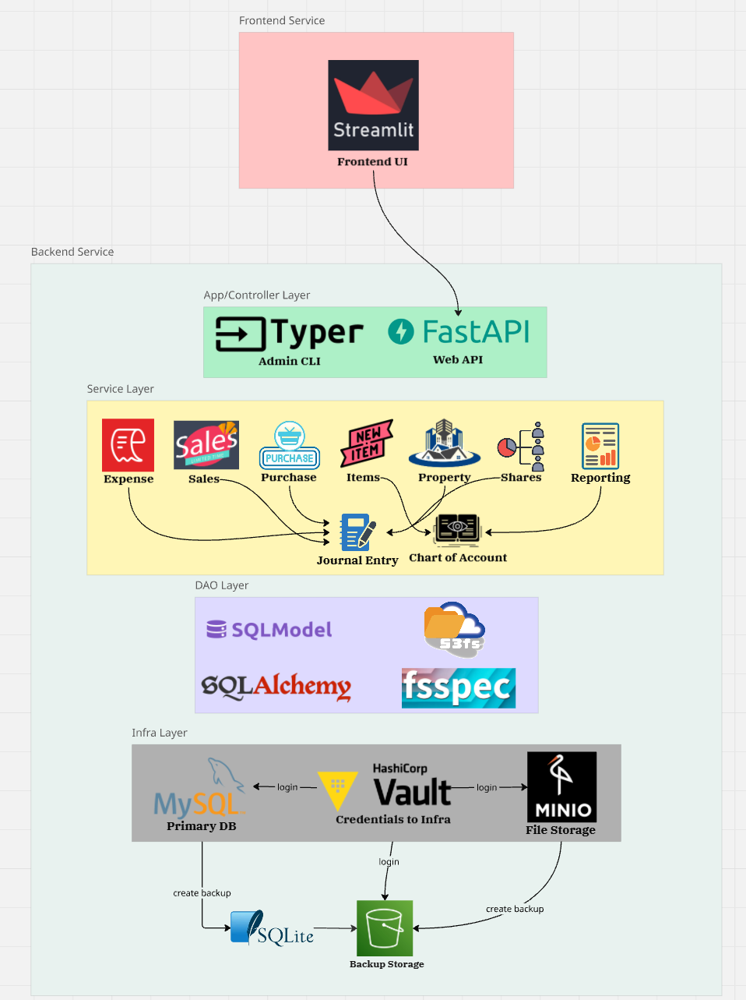
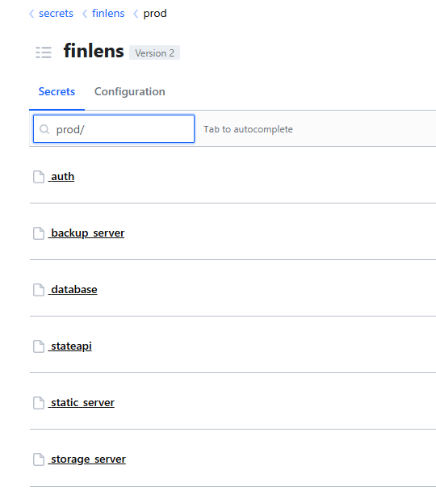
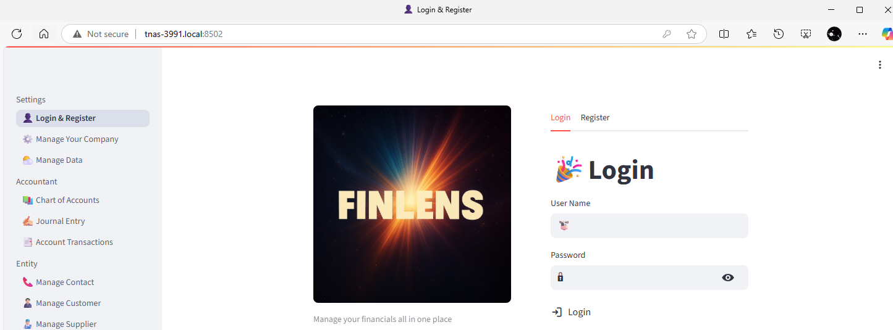

# 💡 Motivation

> **The Problem:** Most accounting software either restricts essential features to paid tiers or is overly complex for small business needs.

My core requirements were simple, I don't need a full ERP system. Since I work with international clients and travel frequently, I needed **native multi-currency support**.

### ✨ **The Solution: FinLens**
**FinLens** fills this gap by providing:
- ✅ **Essential accounting features** 
- 🌐 **Native multi-currency support**
- 🎨 **Clean, simple and accessible interface**
- 🎯 **Small business focused** - no unnecessary complexity

---
*Simple accounting software that just works.* 🚀

# 🚀 What FinLens Brings You
**FinLens provides powerful services for:**

- 🌳 **Chart of account tree**
- 👥 **Contact, client and supplier management**
- 💰 **Sales item, invoice and payment**
- 🛒 **Purchase item, invoice and payment**
- 🧾 **Expense and receipt management**
- ✍️ **Manual journal entry**
- 🏠 **Property and depreciation**
- 📈 **Shares issue, dividend and repurchase**
- 📊 **Balance sheet and income statement**
- 🌍 **All with multi-currency support!**

---
*And it supports user register, login and authentication* 👥

# 🏗️ Architecture

FinLens follows a modern **backend-frontend separated architecture** with a clean RESTful API for seamless communication:

- 🔧 **Backend**: Built with a classical **DAO-Service-Controller** layered structure for maintainability
    - 🚀 **FastAPI Application**: User operations to accounting services
    - 💻 **Admin CLI**: Start up and data management for Admin use
- 🌐 **Frontend**: Clean, responsive interface consuming RESTful endpoints

The following diagram illustrates the architecture and tech stack:



# 🐳 How to Run

Both backend and frontend services are **containerized with Docker** for easy deployment. Pre-built images are available on Docker Hub:

- 🔧 **Backend**: [`luntaixia/finlens-backend`](https://hub.docker.com/repository/docker/luntaixia/finlens-backend/general)
- 🌐 **Frontend**: [`luntaixia/finlens-frontend`](https://hub.docker.com/repository/docker/luntaixia/finlens-frontend/general)

### 📋 Prerequisites

The following services are required to run FinLens:

| Service | Functionality | Description |
|---------|---------------|-------------|
| 🔐 **Vault** | Secret Management | Securely stores database credentials, MinIO/S3 keys, 3rd party API keys, and authentication tokens |
| 📦 **MinIO/S3** | File Storage | Handles file storage and backup operations (can run on same or separate server) |
| 🌐 **Static Server** | Asset Hosting | Serves static resources (CSS, images, fonts) used for invoice HTML generation |

#### 🚀 Setting Up Prerequisites

Navigate to the `depend_services` folder to spin up these services:

```bash
cd depend_services
docker compose -f dependency.docker-compose.yaml up -d
```

#### ⚙️ Configuration Steps

1. **Setup Vault and MinIO** at their specified ports and initialize them
2. **Vault Configuration**: Login to Vault and configure the following credentials:

<details>
<summary>🔐 <strong>**Vault Credential Configuration Details**</strong></summary>

below is the credentials you need to set:



##### 🔑 Authentication Service
**Path:** `finlens/prod/auth`
```json
{
  "algorithm": "HS256",
  "expires_minutes": "60",
  "secret_key": "your-secure-jwt-secret-key-here"
}
```

##### 🗄️ Database Configuration  
**Path:** `finlens/prod/database`
```json
{
  "driver": "mysql+mysqlconnector",
  "hostname": "mysql",
  "password": "your-mysql-password",
  "port": 3306,
  "username": "root"
}
```

> **💡 Note:** If using a different username, grant necessary permissions:
> ```sql
> -- Grant required permissions
> GRANT CREATE ON *.* TO 'your-username'@'%';
> FLUSH PRIVILEGES;
> ```

##### 📦 Storage Server (MinIO/S3)
**Path:** `finlens/prod/storage_server`
```json
{
  "provider": "minio",
  "access_key": "your-minio-access-key",
  "secret_access_key": "your-minio-secret-key", 
  "endpoint": "your.minio.server.ip",
  "port": 9002,
  "path": {
    "bucket": "finlens"
  }
}
```

##### 💾 Backup Server
**Path:** `finlens/prod/backup_server`
```json
{
  "provider": "s3",
  "access_key": "your-s3-access-key",
  "secret_access_key": "your-s3-secret-key",
  "endpoint": "your.s3.server.ip", 
  "port": 443,
  "path": {
    "bucket": "finlens-backup"
  }
}
```

##### 🌐 Static File Server
**Path:** `finlens/prod/static_server`
```json
{
  "hostname": "your.static.server.ip",
  "port": "8080"
}
```

##### 🌍 Geographic API Service
**Path:** `finlens/prod/stateapi`
```json
{
  "apikey": "your-countrystatecity-api-key",
  "endpoint": "https://api.countrystatecity.in"
}
```

> **🔗 Get your API key:** Visit [CountryStateCity API](https://countrystatecity.in) to obtain your free API key.

</details>

### 🚀 Quick Start

Follow these simple steps to launch your FinLens instance:

#### 1️⃣ **Database Password Setup**
Create a MySQL root password file:
```bash
# Create the secrets directory if it doesn't exist
mkdir -p configs/secrets

# Add your MySQL root password
echo "your-secure-mysql-password" > configs/secrets/mysql_root_password.txt
```

#### 2️⃣ **Vault Configuration** 
Create a `secrets.toml` file in the root directory:
```toml
[vault]
endpoint = "http://your.vault.server.ip"  # Vault server URL
port = 8200                               # Vault server port
token = "hvs.your-vault-root-token-here"  # Vault root token
```

#### 3️⃣ **Launch FinLens** 🎉
Start all services with Docker Compose:
```bash
# Launch your FinLens instance from the root directory
docker compose up -d
```

> **✅ Success!** Your FinLens accounting system should now be running and accessible through your configured endpoints:

